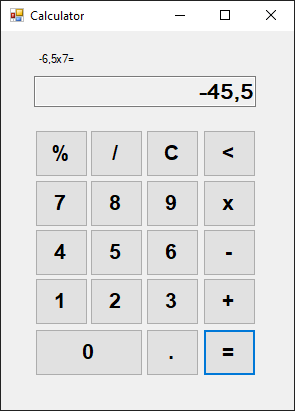

# Calculator app 

En el presente proyecto se crea una calculadora utilizando Windows Forms en .Net 6, ya que nos ofrece un diseñador visual para crear aplicaciones de escritorio de una forma muy productiva.
La aplicación es capaz de realizar cálculos sencillos y guardar resultados:
- Sumar
- Restar
- Multiplicar
- Dividir
- Resto (módulo)
  
También es capaz de borrar el último dígito introducido y reiniciar los cálculos.

A continuación se muestra una imagen de ejemplo:

